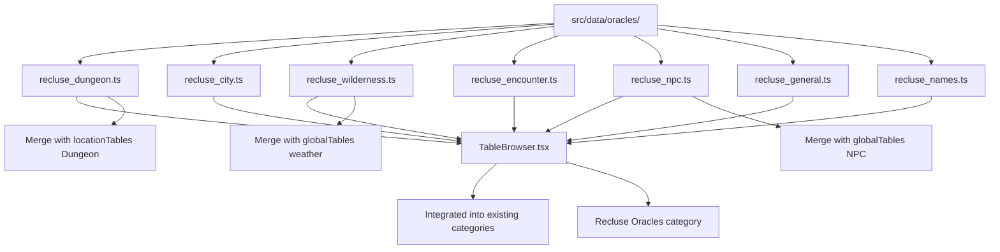

# Integrate Recluse Oracle Tables

## Overview

Add comprehensive Recluse oracle system to the Heretic's Guide to Dying Lands app by creating a new oracle data structure, merging overlapping tables with existing content, and providing flexible UI access.

## Architecture




## Implementation Steps

### 1. Create Oracle Data Files

**Create** [`src/data/oracles/recluse_dungeon.ts`](src/data/oracles/recluse_dungeon.ts)

- Convert all dungeon-related string arrays to Table format
- Infer dice types: 6 items = d6, 12 items = d12, 20 items = d20
- Export: `dungeonOrigin`, `dungeonPurposeNow`, `dungeonTheme`, `dungeonEntranceState`, `dungeonRoomArchitecture`, `dungeonRoomDressing`, `dungeonHazards`, `dungeonDiscovery`, `dungeonEntranceHazards`, `dungeonRoomPurpose`, `dungeonAirTemp`, `dungeonLight`

**Create** [`src/data/oracles/recluse_city.ts`](src/data/oracles/recluse_city.ts)

- Convert city oracle arrays to Table format
- Export: `cityMood`, `neighborhoodType`, `streetActivity`, `buildingType`, `cityRumors`, `cityThreats`, `streetSurface`, `streetSmell`, `streetFeature`, `buildingInterior`, `buildingHiddenElement`

**Create** [`src/data/oracles/recluse_wilderness.ts`](src/data/oracles/recluse_wilderness.ts)

- Convert wilderness arrays to Table format
- Export: `weatherPrecipitation`, `weatherWind`, `weatherTemperature`, `majorLandmarks`, `ruinousLandmarks`, `wildernessThreatSigns`, `strangeLandmarks`, `wildernessHazards`, `unnaturalHazards`

**Create** [`src/data/oracles/recluse_encounter.ts`](src/data/oracles/recluse_encounter.ts)

- Convert encounter arrays to Table format
- Export: `encounterContext`, `encounterDisposition`, `encounterGoal`, `encounterComplications`

**Create** [`src/data/oracles/recluse_npc.ts`](src/data/oracles/recluse_npc.ts)

- Convert NPC arrays to Table format (note: `npcAppearance` has 100 items = d100)
- Export: `npcSummary`, `npcMotivation`, `npcAppearance`, `npcTraits`, `factionPlotHooks`, `factionOrigins`

**Create** [`src/data/oracles/recluse_general.ts`](src/data/oracles/recluse_general.ts)

- Convert action/theme/descriptor arrays to Table format (100 items each = d100)
- Export: `actionOracle`, `themeOracle`, `descriptorOracle`

**Create** [`src/data/oracles/recluse_names.ts`](src/data/oracles/recluse_names.ts)

- Convert name arrays to Table format (100 items each = d100)
- Export: `villageNames`, `npcFirstNames`, `npcSurnames`

### 2. Merge Overlapping Tables

**Update** [`src/data/globalTables.ts`](src/data/globalTables.ts)

- Merge `npcNameTable` (d12) with `npcFirstNames` (d100) → create expanded `npcFirstNameTable`
- Add `npcSurnameTable` from Recluse data
- Merge `weatherTable` with Recluse weather oracles → create `weatherDetailedTable` category
- Keep original simple tables for backwards compatibility

**Update** [`src/data/locationTables.ts`](src/data/locationTables.ts)

- Expand `Dungeon` location tables with Recluse dungeon oracles
- Add missing location-specific oracles where appropriate
- Maintain existing structure for backwards compatibility

### 3. Update UI - TableBrowser Integration

**Update** [`src/components/TableBrowser.tsx`](src/components/TableBrowser.tsx)

- Import all new oracle tables
- **Add new "Recluse Oracles" category** with subcategories:
- Dungeon Oracles (all dungeon tables)
- City Oracles (all city tables)
- Wilderness Oracles (all wilderness tables)
- Encounter Oracles (all encounter tables)
- NPC Oracles (all NPC tables)
- General Oracles (action, theme, descriptor)
- Names (village, first name, surname)
- **Integrate into existing categories**:
- Add dungeon oracles to "Dungeon" location category
- Add NPC oracles to "Character" category
- Add weather/wilderness to "Global" category
- Add encounter tables to new "Encounters" category

### 4. Optional Enhancement - QuickRollers

**Consider updating** [`src/components/QuickRollers.tsx`](src/components/QuickRollers.tsx)

- Add quick roller for "Random Encounter" using encounter oracles
- Add quick roller for "NPC Appearance" using d100 appearance table
- Add quick roller for "Dungeon Room" that combines multiple dungeon oracles
- Maintain existing functionality

## Data Transformation Pattern

Each oracle follows this pattern:

```typescript
// Before (string array)
export const dungeonOrigin = [
  "Forgotten Shrine: Once holy, now desecrated...",
  "War Ruin: A structure shattered...",
  // ... 6 items total
];

// After (Table format)
export const dungeonOriginTable: Table = {
  name: 'Dungeon Origin (d6)',
  entries: [
    { roll: 1, result: "Forgotten Shrine: Once holy, now desecrated..." },
    { roll: 2, result: "War Ruin: A structure shattered..." },
    // ... entries 3-6
  ],
};
```


## Key Files to Modify

1. **New Files**: 7 oracle files in `src/data/oracles/`
2. **Modified Files**: 

- [`src/data/globalTables.ts`](src/data/globalTables.ts) - merge NPC/weather tables
- [`src/data/locationTables.ts`](src/data/locationTables.ts) - expand dungeon tables
- [`src/components/TableBrowser.tsx`](src/components/TableBrowser.tsx) - add dual UI access
- [`src/components/QuickRollers.tsx`](src/components/QuickRollers.tsx) - optional enhancements

## Testing Checklist

- [ ] All oracle tables display correctly in TableBrowser
- [ ] Recluse category shows all subcategories properly
- [ ] Integrated oracles appear in existing categories
- [ ] Merged tables (NPC names, weather) work correctly
- [ ] QuickRollers still function with merged tables
- [ ] Dice rolls match expected ranges (d6, d12, d20, d100)
- [ ] No TypeScript errors
- [ ] Search functionality works with new tables

## Notes

- **Backwards compatibility**: Keep original simple tables where they exist
- **Naming convention**: Use "Recluse" prefix for oracle-specific tables to avoid confusion
- **Dice inference**: 6→d6, 12→d12, 20→d20, 100→d100